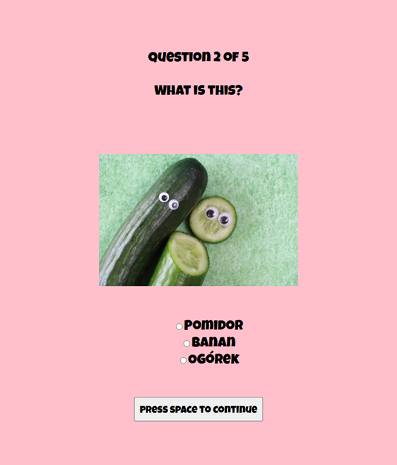

# Polski quiz

[Click here to see deployed game](https://pikkukurkku.github.io/polski_quiz/)

## Description

A quirky little quiz about Poland and the Polish language. No in-depth knowledge required.

## Images

Start screen:

Game screen

End screen

## MVP
- renders a game in the browser
- available online
- has logic for winning/losing
- the game is organized in separate files for HTML, CSS and JavaSxcript
- plain JavaScript used for DOM manipulation
- game entities and elements are organized using classes and OOP
- progress registered on branches and multliple commits
- KISS and DRY priciples

## Backlog

- an animated progress bar
- event handlers for arrows and the enter key, as specified on the start screen
- a toast with immediate feedback for each question

## Data structure

- question class in question.js file
- quiz class in quiz.js for the quiz logic
- script.js for the general game logic

Methods inlude

- start game
- shuffle questions
- show question
- restart quiz
- show results

## States y States Transitions

- start screen (introduction and instructions)
- game screen (loops multiple quiz questions)
- end screen (presents multiple outcomes depneding on result)

## Task

- define the main concept
- specify tasks on Trello Board
- create new repository on GitHub
- create HTML, basic CSS and javaScript files
- search for images online
- code start screen and transition to game screen
- create the javaScript classes
- code the qame logic
- test the game logic
- code the end game screen
- implement restart button functionality
- test website functionality
- update css
- deploy website

## Links

- [Trello Link](https://trello.com/b/HXiTWsPR/polski-quiz)
- [Slides Link](https://prezi.com/p/edit/irgcw7iangz1/)
- [Github repository Link](https://github.com/pikkukurkku/polski_quiz)
- [Deployment Link](https://pikkukurkku.github.io/polski_quiz/)
